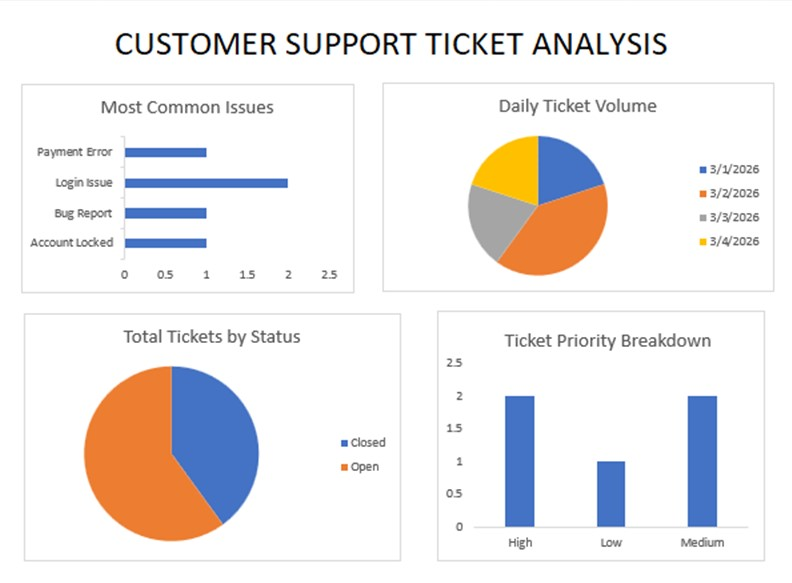

# 📊 Customer Support Ticket Analysis

## Overview

This project analyzes customer support tickets to identify common issues, workload trends, and priority distribution.

Data was created and cleaned in Excel, imported into MySQL, and analyzed using SQL queries.

## Tools Used

* MySQL
* Microsoft Excel

---

## 🤖 Use of AI

AI tools were used to assist in:

* Created realistic synthetic dataset
* Debugging errors in SQL

All outputs were manually validated and refined to ensure accuracy and reliability.

---

## Key Insights

* Login issues are the most common problem
* High-priority tickets remain open longer
* Ticket volume varies by day

## Skills Demonstrated

* SQL aggregation (COUNT, GROUP BY)
* Filtering (WHERE)
* Data cleaning
* Basic data visualization

## 📁 DASHBOARD PREVIEW

---

## 👤 Author

Adriane Clark Ballesteros  
Data Analyst Trainee

* 🔗 GitHub: https://github.com/acbshields12

---

